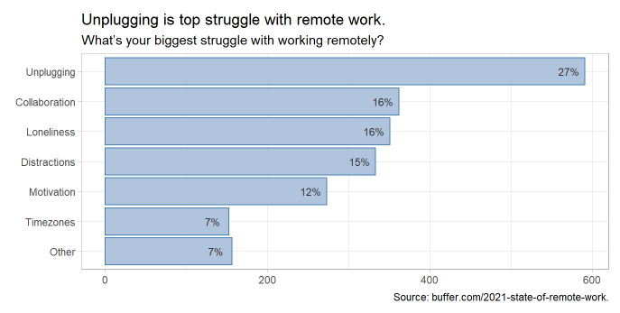

# remote-work

> This project explores the struggles of working remotely, using a late-2000 survey conducted by Buffer. The knitted report is hosted at [https://mpfoley73.netlify.app/remote_work/](https://mpfoley73.netlify.app/remote_work/).

## Table of Contents
* [General Info](#general-information)
* [Technologies Used](#technologies-used)
<!-- * [Features](#features) -->
<!-- * [Screenshots](#screenshots) -->
<!-- * [Setup](#setup) -->
* [Usage](#usage)
* [Project Status](#project-status)
* [Room for Improvement](#room-for-improvement)
* [Acknowledgements](#acknowledgements)
* [Contact](#contact)
<!-- * [License](#license) -->

## General Information
The overwhelming majority of surveyed remote workers prefer to continue working remotely and recommend it to others. But they do share experience with a variety of struggles. A multiple choice question asked 

> What’s your biggest struggle with working remotely?

* *Being in a different timezone than teammates*,
* *Difficulties with collaboration and communication*,
* *Distractions at home*,
* *Loneliness*,
* *Not being able to unplug*,
* *Staying motivated*, or 
* *Other*

My goal is to explore the answers from the remainder of the survey to understand what factors are associated with each struggle. I fit a *K* nearest neighbors (KNN) model to the data to predict the workers' biggest struggle.

## Technologies Used
- R and RStudio.
- *knn* model from the **caret** package.

## Usage
To explore and modify this analysis on your own, fork this repository and run the Rmd files in succession. *1_get_data.Rmd* pulls the data from Google Sheets and prepares it for analysis. _2_explore.Rmd_ explores the survey results. _3_knn.Rmd_ performs the kNN analysis.
Provide various use cases and code examples here.

## Project Status
Project is: _complete_.

## Room for Improvement
The survey consisted of multiple choice questions, and a few free-form response questions. My accuracy rate was around 25% - only slightly better than random guessing at the 6 outcome variable levels. As discussed [here](https://quantdev.ssri.psu.edu/sites/qdev/files/kNN_tutorial.html) and [here](https://stats.stackexchange.com/questions/271043/k-nearest-neighbour-with-continuous-and-binary-variables), classification algorithms struggle with categorical predictors.

Room for improvement:
- I tried a classification and regression tree (CART) model, but got basically the same performance.
- What other algorithms might I explore?

## Acknowledgements
This project was inspired by the Buffer's [2020 State of Remote Work](https://lp.buffer.com/state-of-remote-work-2020) report which was featured in [MakeoverMonday](https://data.world/makeovermonday/2020w32). Buffer has since published its [The 2021 State of Remote Work](https://buffer.com/2021-state-of-remote-work) report and made the data available on [Google Sheets]("https://docs.google.com/spreadsheets/d/1aJFW-_Rq3xNa2Fos-raoA1sF23CwT9sLAfHopjMZnLs/edit?usp=sharing").

## Contact
Created by [Michael Foley](https://mpfoley73.netlify.app/).

